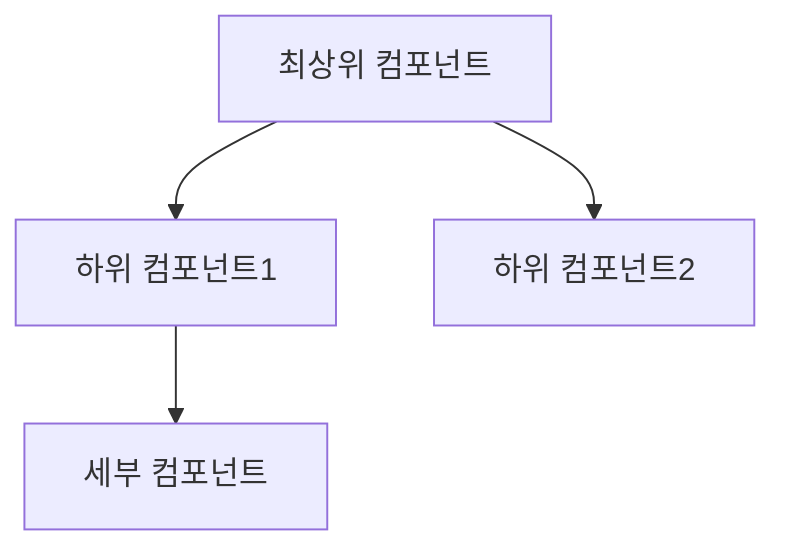
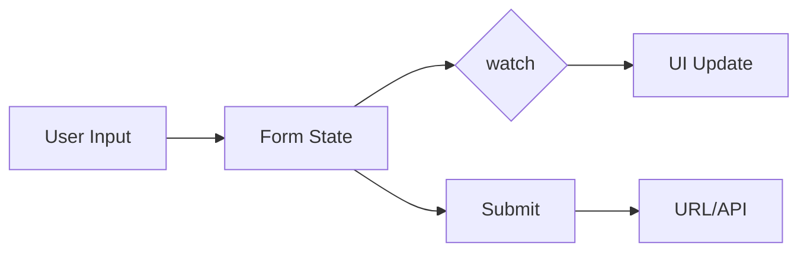

# PR 작성 Skill

## 워크플로우

### 1. Base 브랜치 확인 (필수)

사용자에게 질문: "어떤 브랜치를 base로 PR을 생성할까요? (기본값: main)"
→ 답변 전까지 진행 금지

### 2. 변경점 분석 (병렬 실행)

```bash
git branch --show-current
git status
git log {base}..HEAD --oneline
git diff {base}...HEAD --stat
git diff {base}...HEAD
```

### 3. 코드 분석 (새로 추가/변경된 파일만)

**3.1 컴포넌트 구조 분석**
- 새로 추가되거나 크게 변경된 컴포넌트 파악
- import 관계 분석하여 컴포넌트 계층 구조 파악
- props 전달 패턴 확인

**3.2 상태 관리 패턴 탐지**
- Form 상태: `useForm`, `watch`, `setValue`, `control`, `getValues`
- URL 상태: `useSearchParams`, `URLSearchParams`
- 전역 상태: `useRecoilState`, `useContext`, `useState`
- API 상태: `useQuery`, `useMutation`

**3.3 Mermaid 다이어그램 생성**

**컴포넌트 구조 다이어그램**:


**상태 관리 플로우 다이어그램** (변경된 부분만):


### 4. 템플릿 확인

`.github/pull_request_template.md` 읽기

### 5. PR 내용 작성

| 섹션              | 방법                                                   |
| ----------------- | ------------------------------------------------------ |
| 제목              | 커밋 메시지 기반, feat/fix/chore 등 타입 접두사 제거   |
| Notion 링크       | 브랜치/커밋에서 추출, 없으면 질문                      |
| 배포 버전         | 사용자에게 확인                                        |
| 이슈 종류         | 변경 내용 기반 추론                                    |
| 요약              | 커밋 종합                                              |
| AS-IS             | 사용자에게 확인                                        |
| TO-BE             | diff 기반 설명                                         |
| **구조 다이어그램** | **3.3에서 생성한 Mermaid 다이어그램 포함**             |
| 참고              | 관련 문서/주의사항                                     |

### 6. 사용자 확인

작성 내용 및 다이어그램 검토 요청

### 7. PR 생성

```bash
git push -u origin HEAD  # 필요시
gh pr create --base {base} --title "{제목}" --body "$(cat <<'EOF'
{내용}
EOF
)"
```

### 8. 결과

PR URL 안내

## 주의

- 배포 버전, Notion 링크(없을 시), AS-IS는 사용자에게 질문
- 다이어그램은 변경된 부분만 집중하여 간결하게 작성
- 복잡한 경우 여러 개의 작은 다이어그램으로 분리
- 이미지/GIF는 생성 후 직접 추가 안내
- `--no-verify` 사용 금지
